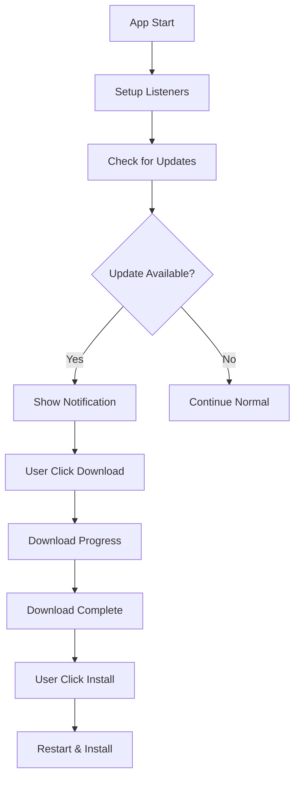

# ระบบ Auto-Update สำหรับ Electron App

## ภาพรวม

ระบบ auto-update ใช้ `electron-updater` เพื่อตรวจสอบและดาวน์โหลดอัพเดทจาก GitHub Releases อัตโนมัติ

## ส่วนประกอบหลัก

### 1. Main Process (electron/main.cjs)
- ตั้งค่า `autoUpdater` ให้ชี้ไปที่ GitHub repository
- จัดการ events: checking, available, downloading, downloaded, error
- ส่ง status updates ไปยัง renderer process ผ่าน IPC

### 2. Preload Script (electron/preload.js)
- เปิดเผย IPC methods สำหรับ renderer process
- Methods: `checkForUpdates`, `downloadUpdate`, `installUpdate`
- Event listeners: `onUpdateStatus`, `onUpdateProgress`

### 3. useElectron Composable (composables/useElectron.ts)
- จัดการสถานะ update และ progress
- ให้ methods สำหรับการ check, download, install
- Setup listeners สำหรับรับ events จาก main process

### 4. ElectronUpdateNotification Component (components/ElectronUpdateNotification.vue)
- UI สำหรับแสดงสถานะการอัพเดท
- Progress bar แบบ real-time
- ปุ่มสำหรับดาวน์โหลดและติดตั้ง
- แสดง error information

### 5. Update Test Page (pages/update-test.vue)
- หน้าทดสอบระบบ auto-update
- แสดงข้อมูลแอป และสถานะ
- ปุ่มสำหรับจำลองสถานะต่างๆ

## วิธีการทำงาน

### 1. การตรวจสอบอัพเดท
```javascript
// Main process
autoUpdater.checkForUpdatesAndNotify();

// Renderer process
await checkForUpdates();
```

### 2. Flow การอัพเดท
1. **Checking**: ตรวจสอบเวอร์ชั่นใหม่จาก GitHub
2. **Available**: พบเวอร์ชั่นใหม่ แสดง notification
3. **Downloading**: ดาวน์โหลดไฟล์อัพเดท พร้อม progress
4. **Downloaded**: ดาวน์โหลดเสร็จ พร้อมติดตั้ง
5. **Error**: เกิดข้อผิดพลาด แสดง error details

### 3. สถานะต่างๆ
- `checking`: กำลังตรวจสอบ
- `available`: มีอัพเดทใหม่
- `downloading`: กำลังดาวน์โหลด
- `downloaded`: พร้อมติดตั้ง
- `error`: เกิดข้อผิดพลาด
- `not-available`: ใช้เวอร์ชั่นล่าสุดแล้ว

## Configuration

### autoUpdater Setup
```javascript
autoUpdater.setFeedURL({
  provider: 'github',
  owner: 'rsdgcxym007',
  repo: 'boxing-ticket-frontend',
  private: false
});
```

### Settings
- `autoDownload: false` - ไม่ดาวน์โหลดอัตโนมัติ
- `autoInstallOnAppQuit: true` - ติดตั้งตอนปิดแอป

## การทดสอบ

### 1. ใน Development
```bash
npm run electron:dev
```

### 2. เข้าหน้าทดสอบ
- URL: `/update-test` (สำหรับ admin)
- จำลองสถานะต่างๆ ได้

### 3. ใน Production
- Build และ distribute ผ่าน GitHub Releases
- ใช้ `electron-builder` สำหรับสร้าง installers

## GitHub Releases Requirements

### 1. Release Tag Format
- ต้องเป็น semantic version: `v1.0.4`
- ตรงกับ version ใน `package.json`

### 2. Release Assets
- **macOS**: `.dmg`, `.zip` files
- **Windows**: `.exe`, `.nsis.7z` files
- **Linux**: `.AppImage`, `.deb`, `.rpm` files

### 3. Release Files Structure
```
releases/
├── latest-mac.yml
├── latest.yml (Windows)
├── latest-linux.yml
├── app-1.0.4.dmg
├── app-1.0.4-mac.zip
├── app Setup 1.0.4.exe
└── ...
```

## Troubleshooting

### 1. Error 404 Not Found
- ตรวจสอบ repository ชื่อและ owner
- ตรวจสอบว่ามี release ใน GitHub
- ตรวจสอบว่า release เป็น public

### 2. IPC Method Not Found
- ตรวจสอบ preload.js มี method ครบ
- ตรวจสอบ main.cjs มี IPC handlers

### 3. Permission Errors
- ตรวจสอบสิทธิ์การเขียนไฟล์
- ใน macOS อาจต้อง sign application

### 4. Network Issues
- ตรวจสอบ internet connection
- ตรวจสอบ firewall/proxy settings

## UI Features

### 1. Notification Modal
- แสดงเวอร์ชั่นใหม่และ release notes
- Progress bar แบบ animated
- แสดงความเร็วและเวลาที่เหลือ
- Error details พร้อม stack trace

### 2. Admin Test Interface
- แสดงข้อมูลแอปปัจจุบัน
- ปุ่มทดสอบฟังก์ชันต่างๆ
- Log แบบ real-time
- จำลองสถานะการอัพเดท

## File Locations

```
boxing-ticket-frontend/
├── electron/
│   ├── main.cjs          # Main process
│   └── preload.js        # Preload script
├── composables/
│   └── useElectron.ts    # Electron composable
├── components/
│   └── ElectronUpdateNotification.vue
├── pages/
│   └── update-test.vue   # Test page
└── scripts/
    └── test-update.sh    # Test script
```

## Events Flow



## Best Practices

1. **Testing**: ทดสอบทุกสถานะก่อน release
2. **Error Handling**: แสดง error ที่เข้าใจง่าย
3. **User Experience**: ไม่บังคับให้อัพเดททันที
4. **Security**: ตรวจสอบ signature ของไฟล์
5. **Rollback**: เตรียมแผนในกรณี update ล้มเหลว

---

สำหรับข้อมูลเพิ่มเติม ดูได้ที่:
- [electron-updater Documentation](https://www.electron.build/auto-update)
- [GitHub Releases API](https://docs.github.com/en/rest/releases)
